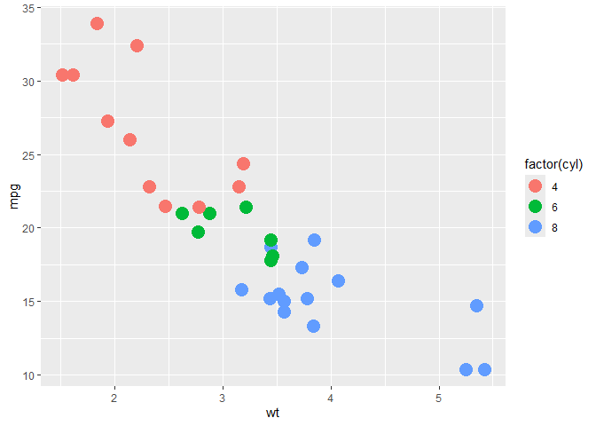
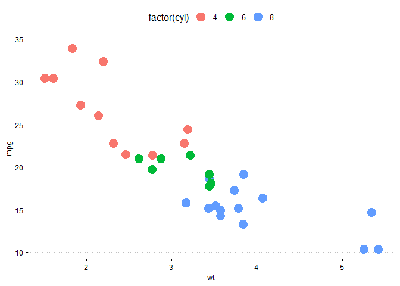
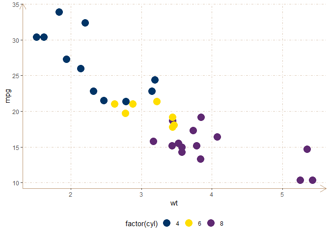
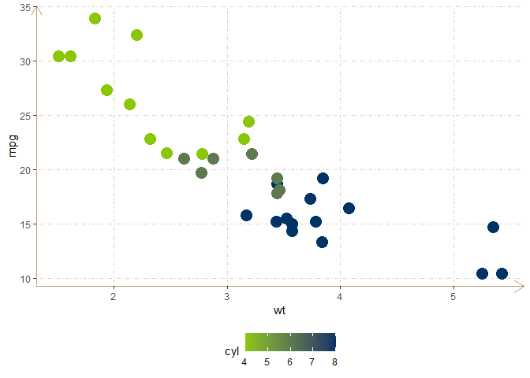
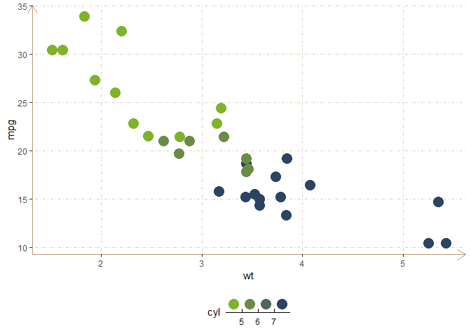

<!-- README.md is generated from README.Rmd. Please edit that file -->

# ggcade

<!-- badges: start -->

[](https://lifecycle.r-lib.org/articles/stages.html#experimental)
<!-- badges: end -->

O objetivo do ggcade é implantar a identidade visual do Cade em
gráficos, mapas e etc.

## Instalação

Para instalar o pacote ….

``` r
# ainda nao e possivel
```

## Exemplo

Digamos que temos o seguinte gráfico:

``` r
library(ggplot2)
library(ggcade)

p1 <- ggplot(mtcars, aes(wt, mpg, col = factor(cyl))) + 
  geom_point(size = 5) 
p1
```



Para adicionar o tema do Cade basta

``` r
p1 + 
  theme_cade()
```



Para adicionar a escala de cores do Cade,

``` r
p1 + 
  theme_cade() + 
  scale_color_cade_d()
```



Escala continua

``` r
ggplot(mtcars, aes(wt, mpg, col = cyl)) + 
  geom_point(size = 5) + 
  theme_cade() + 
  scale_color_cade_c()
```



Escala com intervalos (bins)

``` r
ggplot(mtcars, aes(wt, mpg, col = cyl)) + 
  geom_point(size = 5) + 
  theme_cade() + 
  scale_color_cade_b()
```


